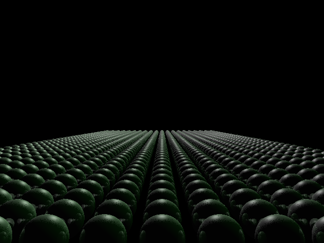
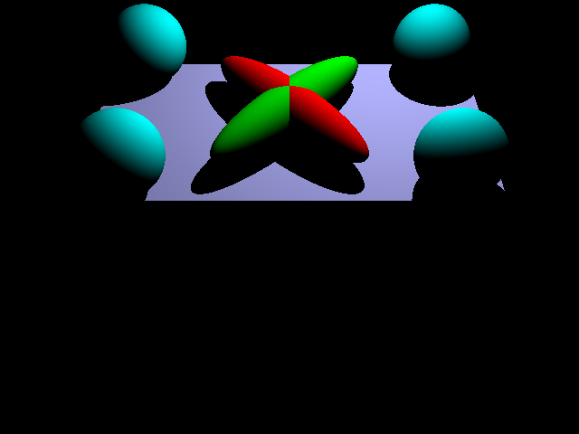
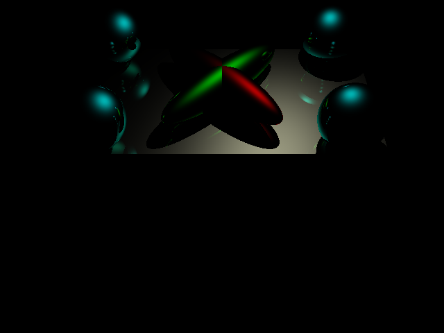

# C++ Physically Based Ray-Tracing Engine

## Overview
This project is a high-performance C++ ray-tracing engine designed to render complex 3D scenes with high fidelity. The engine utilizes OpenGL for the display pipeline and features a physically based rendering model that supports realistic lighting, hard and soft shadows, recursive reflections, and diverse material properties. It is optimized to handle scenes with significant geometric complexity through a hierarchical transformation stack.

## Render Gallery
Below are examples of the engine's rendering capabilities, demonstrating the ability to handle high object counts and isolate specific lighting components.

### Complex Scene Rendering
A "Thousand Spheres" stress test demonstrating depth, occlusion, and shadows across many instances.


### Lighting Component Breakdown
The engine allows for the isolation of specific lighting contributions through its input configuration.

| Component | Render | Description |
| :--- | :--- | :--- |
| **Diffuse** |  | Represents the matte surface color reflecting light based on the angle of incidence. |
| **Specular** |  | Isolates the shiny, reflective highlights determined by surface shininess. |
| **Emission** |  | Shows self-illuminating objects that glow independently of external light sources. |
| **Ambient** |  | Displays the constant base color applied to objects, simulating indirect lighting. |

---

## Features
* **Physically Based Lighting:** Calculates light interaction using Diffuse, Specular, Ambient, and Emission terms .
* **Shadows & Reflections:** Supports recursive ray tracing for accurate reflections (controlled by `maxdepth`) and shadow generation .
* **Hierarchical Transformations:** Implements a stack-based matrix system (`pushTransform`/`popTransform`) to render complex objects composed of multiple primitives .
* **Custom Scene Description Language:** Parses text-based input files to configure scene geometry, lights, and camera settings .

---

## Scene Description Format (Input Guide)
The engine is driven by `.txt` input files. Below is a guide to the commands available for defining scene properties, derived from the project's test files.

### 1. Global Settings & Camera
| Command | Arguments | Description |
| :--- | :--- | :--- |
| `size` | `width height` | Sets the output image resolution (e.g., `640 480`) . |
| `output` | `filename.png` | Specifies the name of the file to save . |
| `camera` | `ex ey ez lx ly lz ux uy uz fov` | Defines the camera: Eye position, Look-at point, Up vector, and Field of View . |
| `maxdepth` | `int` | Sets the maximum recursion depth for rays (e.g., `5`) . |

### 2. Lighting & Materials
The engine uses a state-machine approach for materials; setting a property applies to all subsequent geometry until changed.

* **Lights:**
    * `point x y z r g b`: Defines a point light source at a specific position with a color intensity .
    * `directional x y z r g b`: Defines a directional light (like the sun) with a direction vector and color intensity .

* **Material Properties:**
    * `ambient r g b`: Sets the constant background illumination color .
    * `diffuse r g b`: Sets the matte surface color .
    * `specular r g b`: Sets the reflective highlight color .
    * `shininess s`: Sets the exponent for the specular highlight (higher = smaller, sharper highlight) .
    * `emission r g b`: Sets the self-glow color .

### 3. Geometry & Transforms
Objects are defined within a transformation stack to allow for relative positioning.

* **Transforms:**
    * `translate x y z`: Moves the current coordinate system .
    * `rotate x y z degrees`: Rotates the coordinate system .
    * `scale x y z`: Scales the coordinate system .
    * `pushTransform`: Saves the current transformation matrix to the stack .
    * `popTransform`: Restores the previous transformation matrix .

* **Primitives:**
    * `sphere x y z radius`: Renders a sphere at the given coordinates .
    * `vertex x y z`: Defines a vertex for a polygon .
    * `tri v1 v2 v3`: Creates a triangle using indices of previously defined vertices .

## Example Scene Configuration
The following snippet demonstrates how a scene is constructed using the input format:

```text
# Camera and Output setup
size 640 480 
output scene4-specular.png
camera 0 -4 4 0 -1 0 0 1 1 45

# Lighting setup
point 1 1 3 1 1 1

# Material setup (Specular Example)
ambient 0 0 0
diffuse 0 0 0
specular .6 .6 .5
shininess 20

# Geometry definition with Transforms
pushTransform
  scale 2 1 .25
  # (Triangle definitions omitted for brevity)
popTransform